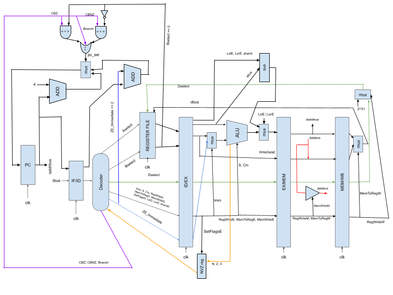
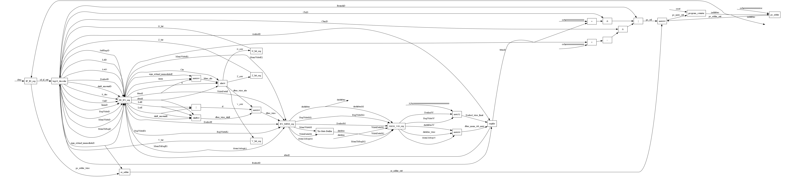

# ARM LEGv8 CPU with Schematic Compiler

This is a Verilog implementation of an ARMv8 CPU with the LEGv8 subset of instructions along with a compiler that generates a schematic from the verilog code.\
CPU implementation found in `cpu5arm.v`. Test bench found in `cpu5armtb.v`. Compiler implementation found in `schematic_generator.py`.\
The CPU is pipelined through 5 stages (Fetch, Decode, Execute, Memory, Write-Back). Xilinx Vivado 2022.1 was used for simulation and testing.\
The schematic compiler works by combining the content of all verilog files listed in `files.txt`, parsing and tokenizing each line, searching for and connecting sub-modules and wires from top module using DFS, adding gates to wire connections when needed, and adding constant numerical inputs when needed. A more in depth explanation is provided in the [Schmematic Compiler Documentation](#schematic-compiler).

## Manually Drawn CPU Schematic



## Instructions

| Instruction   | Opcode      |
| ------------- | ----------- |
| ADD           | 00101000000 |
| ADDS          | 00101000001 |
| AND           | 00101000010 |
| ANDS          | 00101000011 |
| EOR           | 00101000100 |
| ENOR          | 00101000101 |
| LSL           | 00101000110 |
| LSR           | 00101000111 |
| ORR           | 00101001000 |
| SUB           | 00101001001 |
| SUBS          | 00101001010 |
| ADDI          | 1000100000  |
| ADDIS         | 1000100001  |
| ANDI          | 1000100010  |
| ANDIS         | 1000100011  |
| EORI          | 1000100100  |
| ENORI         | 1000100101  |
| ORRI          | 1000100110  |
| SUBI          | 1000100111  |
| SUBIS         | 1000101000  |
| LDUR          | 11010000000 |
| STUR          | 11010000001 |
| MOVZ          | 110010101   |
| B             | 000011      |
| CBZ           | 11110100    |
| CBNZ          | 11110101    |
| B.EQ          | 01110100    |
| B.NE          | 01110101    |
| B.LT (Signed) | 01110110    |
| B.GE (Signed) | 01110111    |

## Schematic Compiler

### Directions for use

1. Make sure `files.txt`, `schematic_generator.py`, and all Verilog files are in the same directory.

2. Populate `files.txt` with all of the necessary Verilog file names, one per line.

3. If you haven't done so already, [download Graphviz](https://graphviz.org/download/).
   If you're on Windows, check “Add Graphviz to PATH” during the install.

4. If you haven't done so already, install the Graphviz Python bindings:

   ```bash
   pip install graphviz
   ```

5. Run the command:

   ```bash
   python schematic_generator.py [top-module-name]
   ```

6. The resulting schematic will be in `[top-module-name].png`. You will likely have to zoom in and scroll.

### Compiled Schematic



### Graph Generation

The graph generation works by doing depth-first search inside of the top module for sub-modules and wire connections. The visual graph and the data collection graph use different data structures. In the visual graph, the nodes are module blocks, registers, logic gates, junctions, and input/output ports. The edges are the inputs, outputs, and wires. This visual graph is generated with Graphviz after the compiler generates it's own internal data structure from the data parsing. In the data collection graph, inputs, outputs, wires, registers, and blocks are all nodes that connect to each other. The starting nodes for the DFS search process are the inputs to the top module. The compiler iterates through and tokenizes each line to find where those inputs are connected to. The search function is recursively called on the connections to the current node. The search function terminates when there are no more connections to search.

### Logic Gate Handling

Wire dataclasses have a field for logic gates. There are single input gates, multi input gates, and tri stage buffers. When a wire is assigned, the line is tokenized and the compiler recursively searches through parenthesis groups for gate assignments. The tokenizer detects the necessary characters. The resursive search terminates when there is a string for another wire. The wire has a field for the bottom gate. Gate inputs are either strings (names of other wires) or other gates. The gates become nodes for the final schematic graph. There is a dictionary connecting the wire names to their respective gate node names so that everything gets connected properly.
